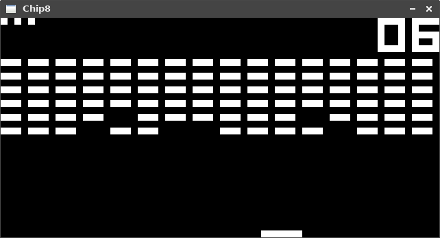
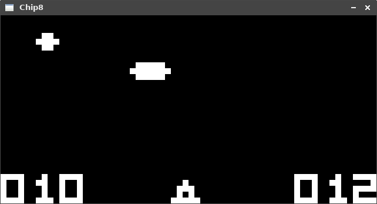

# Chip8 emulator
## Description
A CHIP-8 emulator written in C++ using SDL2.

CHIP-8 is an interpreted programming language, developed by Joseph Weisbecker. It was initially used on the COSMAC VIP and Telmac 1800 8-bit microcomputers in the mid-1970s. CHIP-8 programs are run on a CHIP-8 virtual machine. It was made to allow video games to be more easily programmed for said computers. (From [wikipedia](https://en.wikipedia.org/wiki/CHIP-8))

## Screenshots




## Build & Usage
This project requires ```cmake```, ```SDL2``` and ```SDL2_mixer```. For compilation run the following commands:

```
mkdir build
cd build
cmake ..
make
```

This should create two executables: ```chip8_emulator``` and ```chip8_tests```. To use the emulator you need to provide the path to the ROM file as argument. Some existing ROM's can be found in the [/roms](/roms) directory. For example to load Tetris use:

```
./chip8_emulator ../roms/Tetris
```

## Input
Computers which used the Chip-8 VM had a 16-key hexadecimal keypad. This layout has been mapped as follows:

```
   Hex. Keypad                      Keyboard
+---+---+---+---+               +---+---+---+---+
| 1 | 2 | 3 | C |               | 1 | 2 | 3 | 4 |
+---+---+---+---+               +---+---+---+---+
| 4 | 5 | 6 | D |               | Q | W | E | R |
+---+---+---+---+       =>      +---+---+---+---+
| 7 | 8 | 9 | E |               | A | S | D | F |
+---+---+---+---+               +---+---+---+---+
| A | 0 | B | F |               | Z | X | C | V |
+---+---+---+---+               +---+---+---+---+
```

## Resources
* CHIP-8 Wikipedia: https://en.wikipedia.org/wiki/CHIP-8
* How to write an emulator (CHIP-8 interpreter): http://www.multigesture.net/articles/how-to-write-an-emulator-chip-8-interpreter/
* Cowgod's Chip-8 Technical Reference v1.0: http://devernay.free.fr/hacks/chip8/C8TECH10.HTM